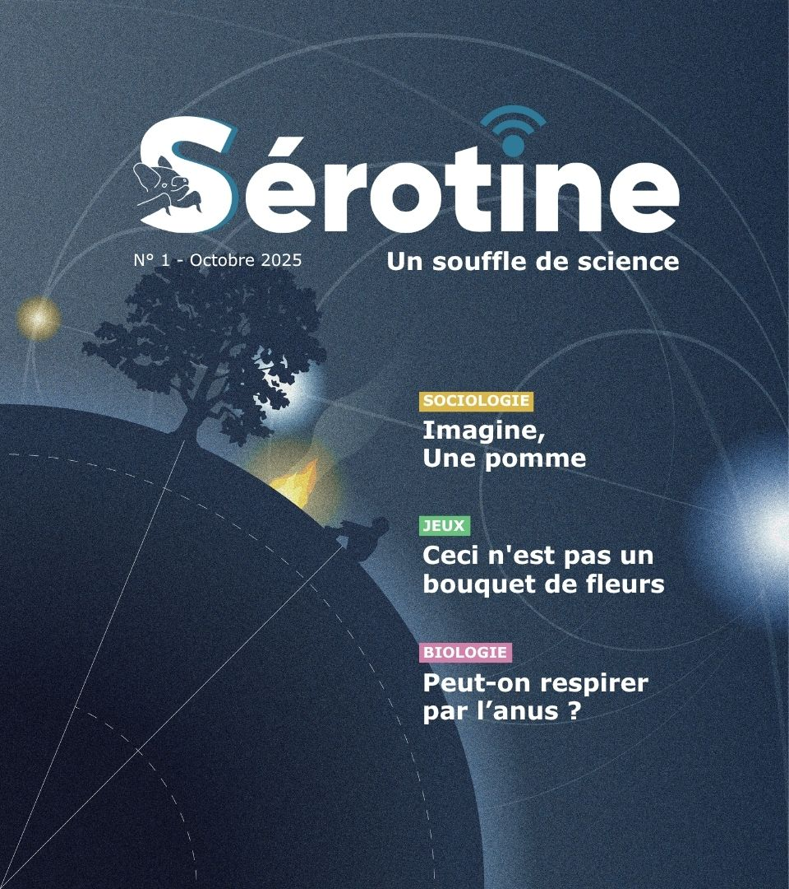

  
  by
  

# Espace commentaires

Bienvenue dans l'espace commentaire du projet Serotine portée par l'association AurorAlpes.
Vous pouvez retrouver ci-dessous, les commentaires associés aux différents numéros du webzine.

Afin de poster un commentaire, il est nécessaire de créer un compte sur GitHub (il est possible de le faire à partir d'un compte Google) ainsi que d'autoriser l'[application giscus][giscus-app] à [publier en leur nom][authorization] en utilisant le flux OAuth de GitHub.

## #1 Octobre 2025

<!-- Flexbox (fonctionne dans la plupart des renderers Markdown qui acceptent du HTML inline) -->

  <!-- Colonne image (fixe / adaptative) -->
  

    
  

  <!-- Colonne texte (liste) -->
  

    <ul style="margin:0; padding-left:1.2em;">
      <li><a href="https://troy314.github.io/giscus/articles/aphantasie.html" target="_blank">L'aphantasie</a></li>
      <li><a href="https://troy314.github.io/giscus/articles/aphantasie_sudoku.html" target="_blank">Ceci n'est pas un bouquet de fleurs</a></li>
      <li><a href="https://troy314.github.io/giscus/articles/respirer_par_anus.html" target="_blank">Peut-on respirer par l'anus ?</a></li>
    </ul>
  

## #2 Novembre 2025
- Rendez-vous en novembre

## Crédits
Pour plus d'information à propos de [giscus](About_giscus.md)

Ce site est développé à partir du projet [giscus](https://github.com/giscus/giscus) développé par [laymonage](https://github.com/laymonage)

